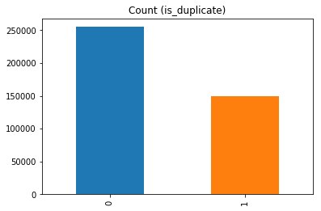
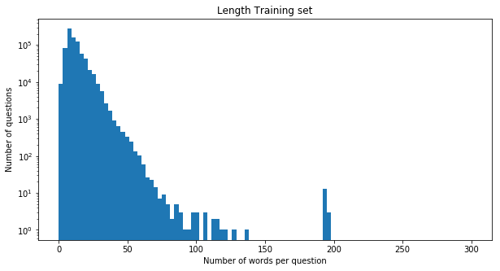
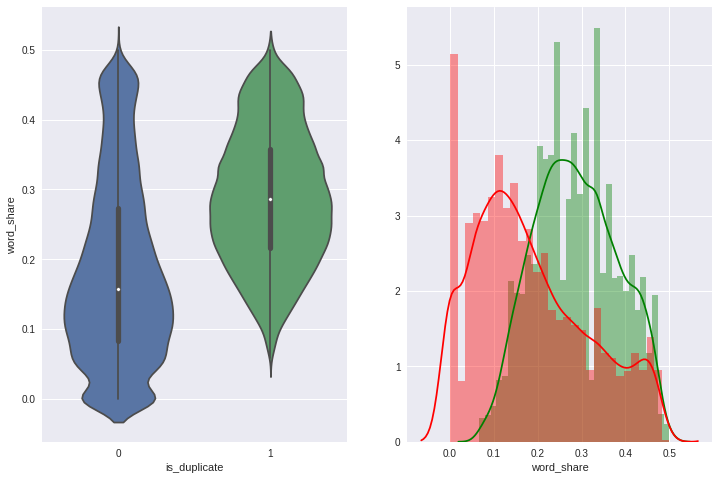
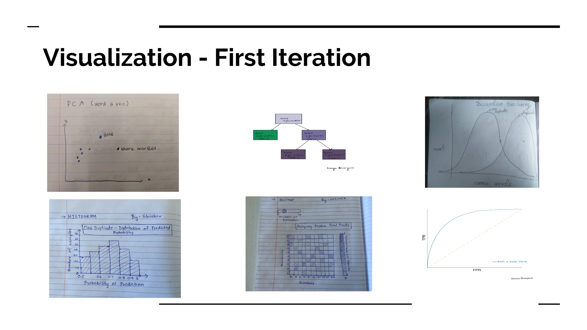
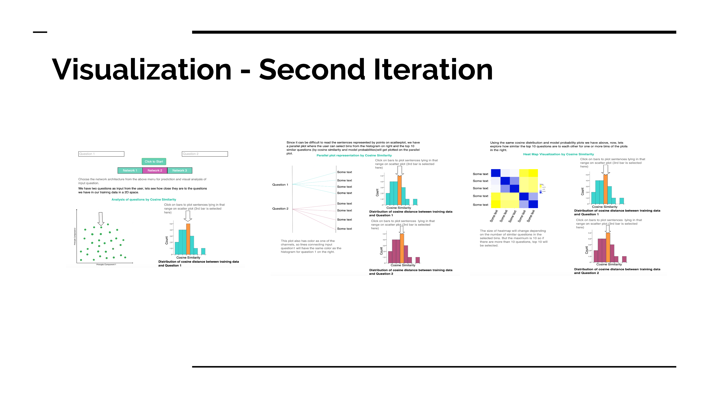
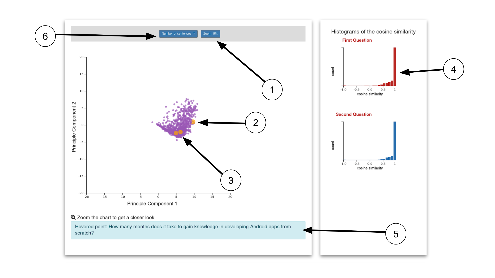
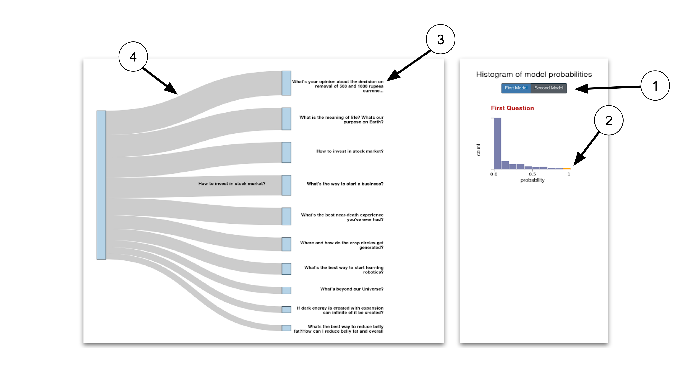

# Motivation

In order to build a high-quality knowledge base, it's important that Q&A platforms like Quora and Stack Exchange  ensure each unique question exists only once. The writers for such platforms shouldn't have to write the same answer to multiple versions of the same question, and readers should be able to find a single non-duplicate page with the question they're looking for. For example, Quora would consider questions like “What are the best ways to lose weight?”, “How can a person reduce weight?”, and “What are effective weight loss plans?” to be duplicate questions. To prevent duplicate questions from existing on such Knowledge bases, our goal is to develop machine learning and natural language processing system to automatically identify when questions with the same intent have been asked multiple times. Our visualization aims to provide users an insight into how these machine learning models perform and to provide a comparison between the duplication result of a neural network and a simple cosine similarity.

# Mathematical formulation

Our problem of duplicate detection can be defined mathematically as follows: given two questions q1,q2 find a model that learns the function: f(q1, q2) → 0 or 1 where 0 is non-duplicate and 1 is duplicate.

# Data Analysis

Quora is a question-and-answer website where questions are asked, answered, edited, and organized by its community of users in the form of opinions. Our dataset for the project is a collection of question pairs from Quora along with their associated attributes. This dataset is readily available on Kaggle.
A brief description of the features present in our data is as follows:


| Feature              | Description                                                                                                  | Type                                                    |
|----------------------|--------------------------------------------------------------------------------------------------------------|---------------------------------------------------------|
| Id                   | The id of a training set question pair                                                                       | Categorical/ordinal                                     |
| qid1, qid2           | Unique ids of each question (only available in train.csv)                                                    | Categorical/ordinal                                     |
| question1, question2 | The full text of each question                                                                               | Text data eventually represented as Quantitative values |
| is_duplicate         | The target variable, set to 1 if question1 and question2 have essentially the same meaning, and 0 otherwise. | Categorical                                             |


Here’s an excerpt of the raw data being used:


| id | qid1 | qid2 | question1                                                                              | question2                                                                                  | is_duplicate |
|----|------|------|----------------------------------------------------------------------------------------|--------------------------------------------------------------------------------------------|--------------|
| 0  | 1    | 2    | What is the step by step guide to invest in share market in india?                     | What is the step by step guide to invest in share market?                                  | 0            |
| 5  | 11   | 12   | Astrology: I am a Capricorn Sun Cap moon and cap rising...what does that say about me? | I'm a triple Capricorn (Sun, Moon and ascendant in Capricorn) What does this say about me? | 1            |

## Exploratory Data Analysis:

Some of the observations made during EDA were:



We have only 290654 unique questions in question1 and 299364 unique questions in question2 features. The distribution of the labels is skewed with numbers of non duplicate question pairs being in majority. But the ratio was nothing drastic and hence resampling was not required.



Then we wanted to know what is the general distribution of the length of sentences in our dataset. By plotting a simple histogram we found that most of the questions have a length of around 25 words. This helped us decide the size of the padding for the deep learning as we needed uniform length inputs.



Since understanding the affect of sementic similarity is one of the goals of our project, we calculated the ratio of the number of common words by total length of the sentences and then compared them by our target labels. Here, we discovered that the question pairs with lower ratio tend to belong to the not duplicate (or label 0) while the higher ratio belonged to duplicate (or label 1) but there was a considerable amount of overlap in the middle as we can see in the plot on the right where colors are used as one of the channels. The green represents label 1 while the red represents label 0.


# Preprocessing 
We used 2 approaches to solve the problem, one is the classic machine learning algorithm, random forest and the other is deep learning network(RNN). For both approaches, we will do the same data cleaning procedures. There is a difference in feature representation for each of the models. Our aim is to represent the textual data present in question pairs in a suitable form to build a classifier. 
The data cleaning procedures we perform on the textual data is as follows:
1.	Normalize the case for all textual data present in questions column
2.	Remove all punctuations and non-alphabetic symbols
3.	Remove stop words
4.	Replace the shorten words with the normal words, for example: you'll into you will

In case of classic machine learning approaches to reduce dimensionality, we perform lemmatization on the text present in the entire dataset and use tf-idf vectorization. For the Recurrent Neural Network, we convert the words in every question into vectors using Stanford University’s pre-trained glove vectors. So, eventually we will have a dataset where each question in a pair is represented as an array of vectors. Each vector is of size 300, as we are using the 300-d GLOVE vectors. 


# Model Description
## Baseline Approach (Random Forest)
We chose Random Forest Classifier as our Baseline model. As it initially was used by Quora itself in their system before replaced by Neural Network model and hence it was a good starting point. The other reason for using it as baseline was that tree-based models are robust and easier to visualize and debug. Visualizing the tree was also a part of our initial proposal. 

### Feature Engineering:
Since we just have two text columns as features, we had to perform feature engineering before training the model. Since sementic similarity can be one of the predictors of duplicacy in considerable amount of cases, we used normalized word share, which is the number of common words by the combined length of both the questions, as one of the features.
Since different words can have different weights in sentences we used normalized tf-idf, which is the total weight of common words by total weight of all the words in question pairs as the other feature.

### Result:
We split the data in 80-20 ratio and tested the performance of the model on validation set. Even though the accuracy score of a model is a good measure to analyze the model performance, it might not be the best option in our case as the dataset is skewed. So we also chose to calculate the roc_auc_score for the same purpose.

The results are as follows:

| Performance metric | Score  |
|--------------------|--------|
| Accuracy           | 74.02% |
| roc_auc_score      | 0.82   |


## Deep Learning Approach 

The goal of our deep learning based approach is to use the sequential information present in the words of a questions to understand the meaning of each question and then compare to see whether they are duplicate. For this purpose we use the Stanford NLP GLOVE representations which contain a vectorised representation of 300 dimensions for a vocabulary of words from Wikipedia. Using the keras pre-processing functions we convert the text present in the questions to tokens. We create a word-vector matrix using the unique tokens present in the data and the corresponding Stanford GLOVE representations. We have a total of 96492 unique words that we use in the word-vector matrix. Using the word-vector matrix we convert each question as a sequence of vectors, each of length 300. The result of the pre-processing is a sequence of vectors representing each question in our data. The max length of the sequence is set to 25 for computational purposes.
### Model Architecture:
The network consist of two input layers, one for each question. Using the input layer we convert the sequence of vectors obtained from the pre-processing into a dense time distributed vector by using an embedding layer followed by a time distributed layer. The output of each input layer, gives us a representation for each question. We concatenate the representations of the input questions and then use the combined vector for further steps. The combined representation is then passed through dense layers consisting of Relu activations and eventually a Softmax layer which gives us the final probability. We introduce batch normalization and dropout of 0.1 to prevent the network from overfitting. The network is trained using cross-entropy loss and Adam optimizer with a learning rate of 0.001. We train the network for 25 epochs using a batch size of 32.
We use two architectures each consisting of different number of dense layers. One consists of 4 dense layers and the other consist of 6 dense layers following the time distributed layers.

### Results:
We test the performance of our model on a validation set consisting of 20% of our train set. Our models perform identical to each other. However, each model has their own strengths and perform better on questions that at times the other does not.

| Model          | Validation Accuracy |
|----------------|---------------------|
| Architecture 1 | 80.86%              |
| Architecture 2 | 83.86%              |


# Task Analysis

| Index | Domain Task                              | Analytic Task | Search Task | Analysis Task |
|-------|------------------------------------------|---------------|-------------|---------------|
| 1     | Discovering pattern in the training data | Encode        | Browse      | Discover      |
| 2     | Examine the pattern in,input queries     | Import/Derive | Lookup      | Present       |


## Task Summary

Our visualizations are primarily developed for the “Discover” and “Present” analysis task. From the dataset, we generated features from text such as vectors for the sentences, cosine similarity etc. and used PCA (truncated SVD) to visualize the data in lower dimensions. This would belong to the “Discover” consumption. 

Along with detection of duplicacy in the user input question pair, we also want the user to have a better understanding of how our machine learning models can identify the meaning of text rather than just sticking with sementic similarity.

We have a scatterplot where user can see their input questions with respect to points in our training set in 2 Dimensional space. They can then browse through the dataset by choosing the cosine similarity or model probabilities from the bins of histograms present right next to the scatterplot. 

They can then "look up" the top ten questions of each bin of histogram with the help of sankey plot where the width of each node "present" the weight by our models for the selected questions and user input.

We also present the degree of similarity between the top 10 questions with each other using a heatmap to give user a better understanding of the functionality of our ML models. 

# Design Process
As like software development process, visualization is also an iterative process, an agile process. Now we can see our top-down approach.

## Initial Sketches


Based on our task analysis, we try to come up with an idea to encode a text classification problem into a data visualization. 
From here, we select some sketches for the next iteration. The first sketch is very intuitive,  a scatterplot of 2-D representation of the sentence which we reduce it by doing a PCA. We also include the histogram of the probability and the heatmap for the next iteration. All of them are being used to address the task we mention earlier: discovering pattern, examine the pattern in input queries.

## Final Sketches


There are many feedbacks we receive during the iterations, one of them is from our instructors. The feedback was to use the histogram to filter the scatterplot. In this one, we also implement one more visual encoding: a sankey diagram. The purpose of the sankey is similar with the heatmap, the difference is the encoding, for example instead of color we use size as a channel.

The colors used for the visualizations in this report are for representation purpose only. We found out that the color scheme used is not color blind safe and we will change it in the final project. 

# Final Visualization

Our visualizations are mainly developed for “Discover” and “Present” consumptions.The visualizations are interactive and linked. We allow our potential user to enter a question pair. We fetch similar questions and allow the user to pick the most similar questions with a range of visualizations all interlinked to one another. The user will also enter a choice amongst 2 neural networks that we developed to predict the similar questions with. 
Firstly we have a histogram plot to show the distribution of similarity scores (cosine and neural network predicted scores) with the input questions and our dataset. This allows the user to see  the number of similar questions in each bucket and can then visualize the questions of that bucket in a 2D space with the help of PCA. We incorporate the Shneiderman mantra by displaying all points in default state and then enable the user to filter the questions using on click events and view details as per his demand.
The next step is to see how similar the questions in the bucket chosen are to the input ones. We have added a new sankey plot visualization with input questions on the left and predicted similar questions on the right. The width of the links of the questions give details about the similarity measure by which we predicted them. They would have two different colors as we have two scores viz. cosine similarity and model scores. This involves a hover over functionality that would highlight the question point being hovered once the user hovers over an input question. We use color encoding to differentiate between the two methods used to calculate the similarity. Also, by displaying the list of questions in parallel plots we enable connectivity and proximity principles.
We then have a heatmap which uses a gradient color scheme to show how similar the picked questions are to each other. This is done not only to help the user pick the most similar question but also to for us to see how the model has performed, as these questions must be somewhat similar to each other. We create heatmaps for analyzing both the cosine similarity predictions as well as the model predictions. This visualization serves the task of analyzing our model performance using the generated outputs (in this case the similar questions of the distribution bucket).
All the visualizations have details on demand on hover/click as explained in the sketches above. In the very end we will also show the result of our prediction as just a text explaining “duplicate” or “not duplicate”.




1. We realized that there are occlusions on the scatterplot, therefore we need zoom. This is not the end, after we implement the zoom, we realize that we need to reset the zoom. This will help with the orientation.
2. We realize the point can be small, we add a visual help to guide the user where they hover. In this one, we implement Steven Braun feedback, so when you don't hover anything you will get a hand cursor, and then when you click it will change to grab cursor and if you hover to the point, it will still be default.
3. Out input data: We make it bigger to give an initial clue of where the input is located on the histogram.
4. Histogram of cosine similarity, which we use it for filtering: Once you click, you can filter the points.
5. To address the Lookup task we then show the text when the user hover. We add one feedback from our classmate, where previously the text was hard to notice, therefore now we put it in the box.
6. We can also change the number of points we want to show, we can change it to something bigger, the bigger the number the slower it gets.



1. Here we can also filter based on the model.
2. As the previous visualization, we can also filter based on the bin.
3. his is the highest top 10 text in the bin.
4. The band of the probability.


1. The color is the probability: like the Sankey it is another way to encode the value.
2. The triangle will move once we hover it, this will help user know where in the range the value falls.

The 10 quesitions are from the selected bin as like the sankey.

In the end, we realize that a good clue from a simple Human Computer Interaction will help the user understands the plot better.

## Inference from the visualisation

Each visualization answers a hypothesis we formulated. The first part shows how the similar questions and the input questions lie on a 2 dimensional space. If there is an overlap in the higher probability buckets selected for both questions then we can infer that they belong to a similar cluster category. So, this tells us that although two questions have been marked as non duplicate by the ML algorithm, the fact that they overlap indicated they belong to the same cluster. Consider the example: How does the Surface Pro himself 4 compare with iPad Pro? And Why did Microsoft choose core m3 and not core i3 home Surface Pro 4?  As input.
These questions are marked as non-duplicate but have overlapping similar questions in the scatterplot. We can infer that these questions are related to technology hence the overlap.

The sankey plot helps view the top similar questions for each input question. The width of the links shows the magnitude of duplication predicted by our model. We display these questions as a way of recommending similar questions to the input question.

The heatmap shows whether questions lying in a particular bucket are similar to each other. We know they are similar to the input question to a degree represented by the scoring bucket they lie in. But are they similar to each other as well? The heatmap helps to analyse this transitivity.


## Package used

Server: 

```
nltk==3.3
numpy==1.15.4
scipy==1.1.0
Flask_RESTful==0.3.7
Keras==2.2.4
boto3==1.9.47
Flask_Cors==3.0.7
Flask==1.0.2
tqdm==4.28.1
pandas==0.23.4
tensorflow==1.13.1
boto==2.49.0
scikit_learn==0.20.3
```

Visualization:

```
d3 + (d3-sankey)
bootstrap
```

 _Please note, the link should use http not https_


  

